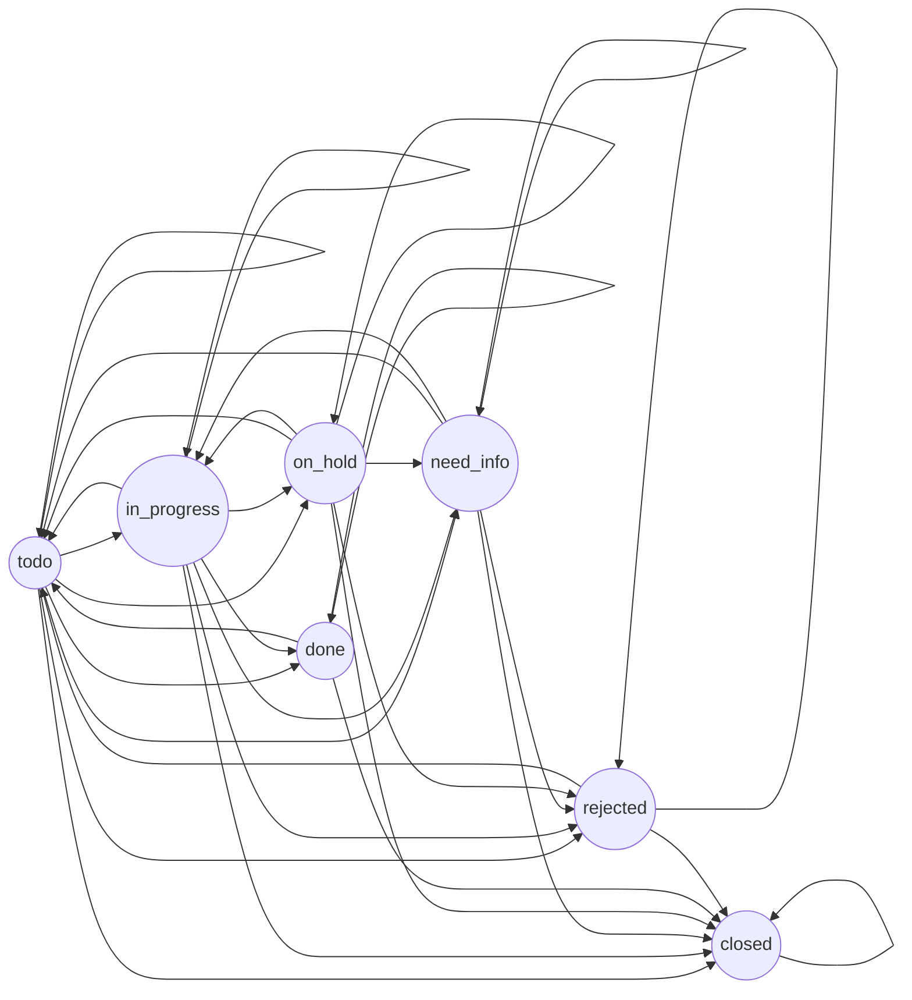

##Описание приложения "TaskManager"

Приложение представляет собой api-движок для управления задачами. (Облегченная jira для команд)

Приложение умеет:

1. Создавать задачи
2. Добавлять вложения
3. Добавлять комментарии
4. Менять статусы/исполнителей

Дополнительно

* У приложения настроена работа с actuator.
* Приложение полностью готово для деплоя в Docker.

___
##Справочная информация
* тестовое окружение в docker можно поднять с помощью файла /docker/
* креды к БД для тестирования:

```--DB_USER=test --DB_USER_PASSWORD=test --JDBC_URL=jdbc:postgresql://localhost:5432/task_manager```

* Для создания БД нужно запустить скрипты ```/src/main/resources/db/scripts/create_db_test.sql```
___
## Статусы задач

1. todo
2. in_progress
3. need_info
4. on_hold
5. done
6. rejected
7. closed

Переходы между задачами (стандартный  WF)

___
## users

Для тестирования были созданы пользователи

Креды пользователей:

| пользователь | пароль |
|:------------:|:------:|
| user | password |

В БД хранится 100 других пользователей, для простоты был добавлен user
___
## Управление вложениями

Для управления вложениями создан функционал, где в БД прикладывается мета о файле (Путь к нему, статус жизненного цикла, путь в файловой системе и имя для ui интерфейса)
___
## actuator

Пользователю с кредами

| пользователь | пароль |
|:------------:|:------:|
| actuator | password |

выдана возможность просматривать статистику от actuator
___